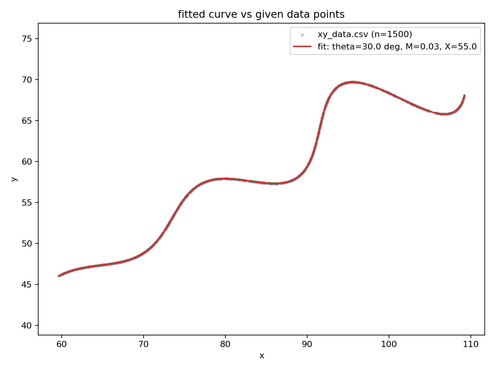

# Assignment for Research and Development / AI

Given curve:

```
x(t) = t*cos(theta) - e^(M|t|) * sin(0.3t) * sin(theta) + X
y(t) = 42 + t*sin(theta) + e^(M|t|) * sin(0.3t) * cos(theta)
```

with `theta` in (0, 50) deg, `M` in (-0.05, 0.05), `X` in (0, 100), `t` in (6, 60).

Task was to recover theta, M, X from `xy_data.csv` (1500 x,y points).

## Answer

```
theta = 30.0000 deg   (0.523599 rad)
M     = 0.0300
X     = 55.0000
```

Submission string:

```
\left(t*\cos(0.5236)-e^{0.03\left|t\right|}\cdot\sin(0.3t)\sin(0.5236)+55,42+t*\sin(0.5236)+e^{0.03\left|t\right|}\cdot\sin(0.3t)\cos(0.5236)\right)
```
domain: `6 <= t <= 60`

Desmos copy with the fitted curve plotted against the original graph: [https://www.desmos.com/calculator/qrrkmpmhpq]



## Step wise process

First thing I checked before writing any fitting code: are the rows in
`xy_data.csv` ordered by t or not? This matters a lot because if they were,
I could've just fit x and y against row index directly (basically linear
regression on rotated coordinates). If not, i can't use index as a stand-in
for t at all.

Checked this by computing the distance between consecutive rows:

```
min: 0.021, max: 52.689, mean: 18.625, std: 12.526
```

If the data was t-ordered, consecutive points must be closer 
since the curve is continuous and the distances must be small and smooth. Instead
they're all over the place, so the rows are shuffled. That rules out plain
regression and means this has to be seen as fitting a curve to an
unordered point cloud and i know the points lie somewhere on the curve,
just not which t each one corresponds to.

### loss function used

For a candidate (theta, M, X):

1. sample the curve densely for a bunch of t values in (6, 60)
2. for every data point, find the distance to the closest point on that
   sampled curve (kd-tree for this, much faster than brute-force distance
   checks against 1500 points x thousands of samples)
3. loss = mean of squared nearest-neighbour distances across all data points

This is basically the same idea behind ICP (iterative closest point) used in
point-cloud registration / robotics but here i don't need to know correspondence
between data point and curve parameter, i just need "is every point close
to some part of my candidate curve."

### optimization done

The loss surface isn't convex - the `exp(M|t|) * sin(0.3t)` term riding on
top of the rotation means there are local minima (a wrong theta can still
roughly line up the general shape of the point cloud while missing the fine
wobble). So:

1. `scipy.optimize.differential_evolution` over the given bounds first, to
   search globally instead of getting stuck near a bad initial guess
2. `Nelder-Mead` from that result to polish it down further

Ends up converging to theta=30 deg, M=0.03, X=55 with loss ~4e-5, which is
basically float noise at that point.

### double-checking the fitted curve

Resampled the fitted curve at much higher resolution (20k points instead of
3k) and recomputed nearest neighbour distance for all 1500 data points:

```
max residual : 0.00232
mean residual: 0.00079
rms residual : 0.00093
```

That's small enough (and the recovered numbers are clean round values) that
I'm treating this as an exact recovery rather than an approximate fit.

### checking against their actual grading metric


> "The L1 distance between uniformly sampled points between expected and predicted curve (max score 100)"

so I figured I should actually check this myself instead of just trusting the
residuals from the fitting step, since that used nearest neighbour distance
(euclidean, and against the raw scattered points) which isn't quite the same
metric they said they'd use.

L1 here just means: pick a bunch of t values spaced evenly across (6, 60),
plug them into the expected curve and my predicted curve separately, and add
up `|x_expected - x_predicted| + |y_expected - y_predicted|` for each t, then
average. No square roots involved like euclidean, just plain absolute
differences per axis.

Problem is I don't actually have their expected curve to compare against
(that's their held out ground truth), so the best I can do is sample my
curve uniformly over t and match each sampled point to the closest point in
`xy_data.csv` as a stand-in for "expected", and use that as an L1 estimate:

```
n uniform samples: 200
L1 per point -> mean: 0.02465, max: 0.18093
```

x values in the dataset go from about 60 to 110 and y from about 45 to 70,
so a mean L1 error of ~0.025 on a range of ~50 works out to roughly 0.05%
off. Given the numbers I recovered are clean (30 deg, 0.03, 55) and not
some messy decimal, I'm fairly confident this is the actual generating
curve and not just a close approximation, so this metric should end up
near the top of that 100 point range.

## assumptions that are made

- data points sit on (or extremely close to) the curve for some valid t in
  (6, 60) - no meaningful noise beyond floating point rounding
- row order in the csv carries no information about t (checked, not assumed)
- curve doesn't self-intersect closely enough within (6,60) to cause
  nearest-neighbour mismatches - the tiny residuals after fitting back this up

## limitations or the things that could go wrong with this approach

- nearest-neighbour fitting recovers the curve's shape, not the original t
  value for each point but if i needed per-point t back then i would have to do a
  second pass (project each data point onto the fitted curve) 
- if the curve looped back on itself closely, points could snap to the wrong
  branch of the curve during fitting but it wasn't an issue here but worth noting
- fit quality depends on how densely i sampled the candidate curve during
  optimization - too sparse and residuals get inflated for reasons that have
  nothing to do with the actual parameters being wrong
  
## references 

Didn't come up with the nearest-neighbour fitting idea out of nowhere, so
putting down where it's actually from instead of just name-dropping ICP:

- Besl, P. and McKay, N., "A Method for Registration of 3-D Shapes", IEEE
  Transactions on Pattern Analysis and Machine Intelligence, 1992 - this is
  the original ICP paper, its where the whole "match each point to its
  nearest neighbour on the other shape, no correspondence needed" idea comes
  from. I'm not doing the iterative re-matching part they describe (my
  params are continuous and I optimize them directly instead of alternating
  between matching and transforming), but the core distance metric is the
  same one.
- Storn, R. and Price, K., "Differential Evolution - A Simple and Efficient
  Heuristic for Global Optimization over Continuous Spaces", Journal of
  Global Optimization, 1997 - this is the algorithm behind
  `scipy.optimize.differential_evolution`, used it because the loss surface
  has local minima and a plain gradient based method could get stuck.
- scipy docs for the two functions actually used:
  https://docs.scipy.org/doc/scipy/reference/generated/scipy.optimize.differential_evolution.html
  and
  https://docs.scipy.org/doc/scipy/reference/generated/scipy.spatial.cKDTree.html

## files

- `fit_curve.py` - the actual fitting (loss function, kd-tree lookup,
  differential evolution and nelder-mead)
- `plot_overlay.py` - draws the fitted curve over the raw scatter, produces
  `fit_overlay.png`
- `xy_data.csv` - given dataset
- `requirements.txt` - numpy, pandas, scipy, matplotlib

## running it

```
pip install -r requirements.txt
python fit_curve.py
python plot_overlay.py
```
